# Projeto de Dados Agrometrika

Criação de um Workflow (fluxo de trabalho) de dados que simplifica o processo de ETL.

## 🚀 Começando

Esse projeto se deu inicio a partir de uma solicitação da supervisora do departamento de Crédito da empresa que trabaho. Atualmente o departamento de crédito trabalho com a plataforma Agrometrika para fazer analise de crédito de clientes no segmento do agronegócio e varejo. Eles estavão tendo algumas dificuldas em realizar a junção de algumas informações, pois tinham que concatenar varios relatório que o sistema fornecia. Diante disso, ela solicitou uma forma que essas informações ficasse centralizadas  para facil acesso, assim alimentar o dashboard de créditos aprovados, com o intuito de sincronizar as informações com o BI e garantir uma melhor apresentação ao comitê. Diante desse cenário optamos por criar um workflow utilizando ferramentas open source, como **Apache Hop**, **PostgreSQL**, **Docker** e **JenKins**. Na imagem abaixo mostra como ficou o fluxo de dados.

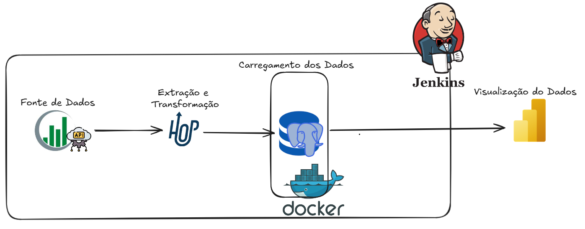

### 📋 Pré-requisitos

De que coisas você precisa para instalar o software e como instalá-lo?

* Apache Hop - [apache-hop-client-2.13.0](https://hop.apache.org/download/)

* Docker desktop - [Docker](https://docs.docker.com/desktop/setup/install/windows-install/)

* Postgres - [PostgreSQL](https://www.postgresql.org/download/windows/)

* Jenkins - [Jenkins](https://www.jenkins.io/download/thank-you-downloading-windows-installer-stable/)

## 1º Fonte de Dados
Conforme mencionado anteriormente, a origem dos dados é a API fornecida pela equipe da Agrometrika, que também disponibilizou a documentação detalhando toda a arquitetura da aplicação. A API REST da Agrometrika permite enviar dados cadastrais de clientes e consultar informações sobre propostas de crédito aprovadas. A documentação explica como realizar a autenticação na aplicação e lista os recursos (endpoints) disponíveis. Por questões de segurança, é necessário informar uma credencial de acesso por meio de uma requisição POST, que retorna um token de autenticação a ser utilizado nas demais requisições aos outros endpoints. Esse token tem validade de 1 hora, ele também é vinculado ao IP da requisição de autenticação e é renovado a cada nova requisição aos outros recursos. Caso passe 1 hora sem atividade, o token expira, sendo necessário gerar um novo.

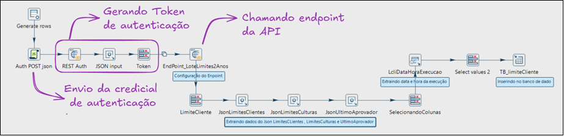

## 2º Extração e Transformação

Para a extração e transformação dos dados obtidos pela API da Agrometrika, utilizamos o Apache Hop, uma ferramenta voltada para a criação de pipelines e workflows de dados. Dentre os recursos disponíveis na aplicação, optamos por utilizar apenas quatro endpoints, que já atendem às necessidades da solicitação. Vale destacar que, dependendo do endpoint, foi necessário ajustar a modelagem dos dados durante o processo de tratamento. Os endpoints selecionados são:
* Proposta áreas de cultivos:
	* Este recurso é utilizado para consultar as áreas de cultivo na última proposta cadastrada para um cliente.
	* A chave para correspondência do cliente no Agrometrika é o código ERP do cliente que deseja buscar as informações.
    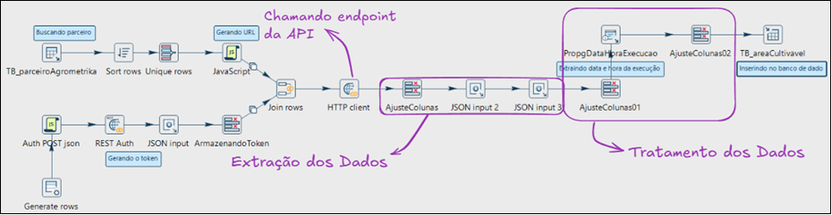

* Dados cadastrais do parceiro:
    * Este recurso é utilizado para consultar os dados do cliente cadastrado no sistema Agrometrika. Aqui somente os dados cadastrais são transferidos.
    * A chave para correspondência do cliente no Agrometrika é o número do CPF/CNPJ (numCPF/numCNPJ)
    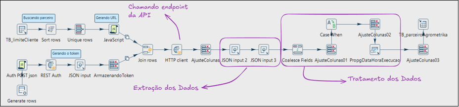

*	Limite aprovado:
    * Este recurso é utilizado para obter as garantias vinculadas às propostas aprovadas de cada cliente. 
    * Se houver propostas aprovadas para o cliente, a API devolverá a lista de garantias vinculadas a esta proposta
    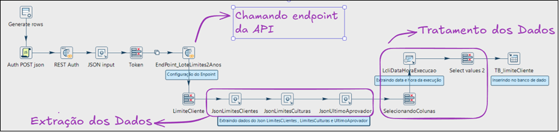

*   Garantias vinculada na proposta:
    * Este recurso é utilizado para obter as garantias vinculadas às propostas aprovadas de cada cliente. 
    * Se houver propostas aprovadas para o cliente, a API devolverá a lista de garantias vinculadas a esta proposta.
    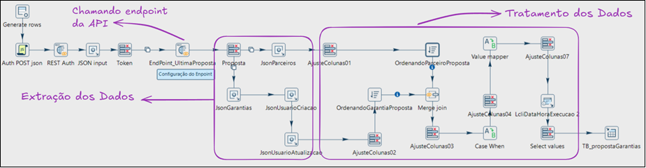

## 3º Carregamento dos Dados
Como esse projeto não possui uma complexidade grande, optamos por utilizar um ambiente dockerizado, em que utilizamos uma instância de um container do banco de dados PostgreSQL, permitindo assim o armazenamento dos dados de forma segura. Além disso, contamos com o aplicativo Docker Desktop para realizar o gerenciamento da instância que foi criada, outro ponto a destacar é a questão do armazenamento, por padrão os containers Docker consome um espaço pequeno comparado a uma máquina virtual (VM).

* Na imagem abaixo mostra a instância do PostgreSQL sendo executado através do aplicativo Docker Desktop:
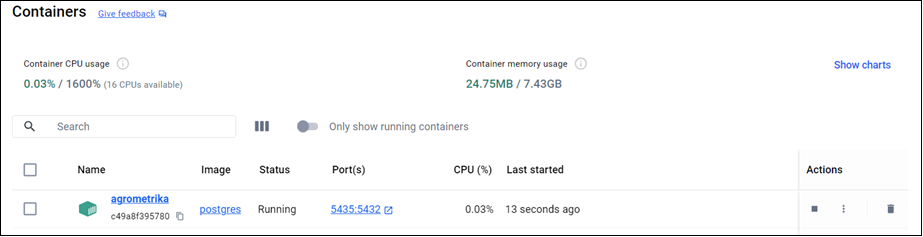

* Conforme mencionado anteriormente, foi necessário criar quatro pipelines e, durante a modelagem dessas pipelines, foram criadas as tabelas para armazenar os dados extraídos. Abaixo, segue a imagem do diagrama das tabelas:

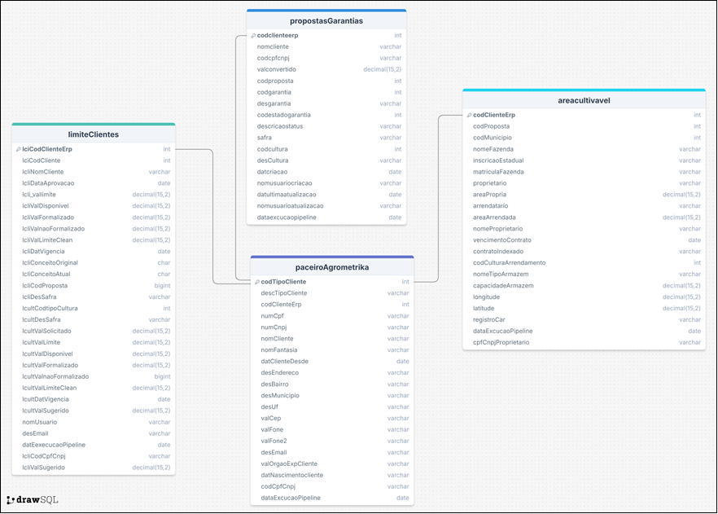

* Na imagem abaixo mostra a ferramenta pgAdim que pode ser utilizada para gerenciado o banco de dados do projeto:

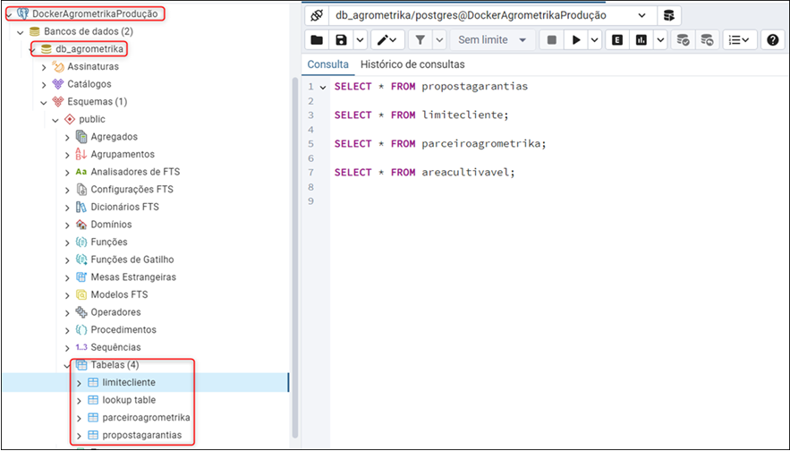

* E por fim, na imagem abaixo mostra as tabelas do banco de dados sendo referenciado no aplicativo do Power BI.

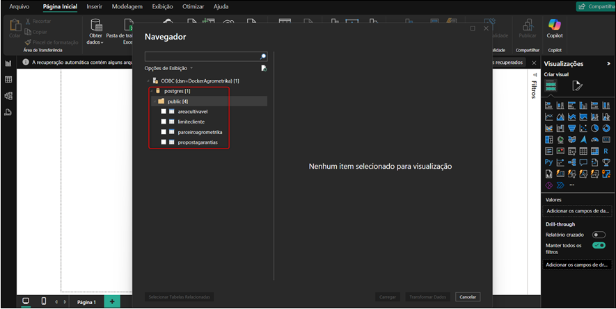

## 4º Configuração de envio de mensagem de erro

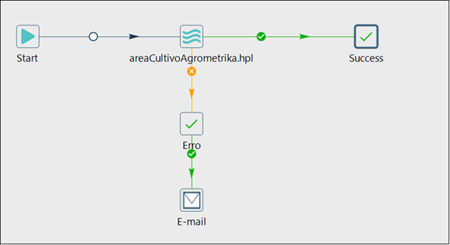

* Na imagem abaixo mostra o exemplo da mensagem que iremos receber caso tenha algum erro em alguma pipeline do projeto.

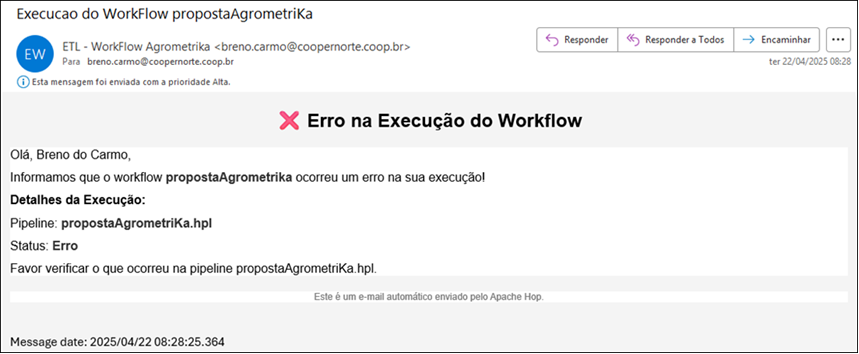

## 5º Periodicidade da execução do Workflow

Com relação ao agendamento de execuções do workflow, é importante considerar que algumas pipelines, como a da **areaCultivavel**, geram um custo elevado devido à quantidade de requisições. Nesse caso, as requisições são feitas por cliente, ou seja, o número de clientes determina o número de requisições. Isso pode resultar em um alto volume de requisições, causando sobrecarga no servidor da Agrometrika e potencialmente tornando o serviço indisponível por um período. Minha sugestão é executar esse workflow apenas uma vez por dia, às 12h30, para minimizar o impacto no servidor e garantir maior estabilidade do serviço.

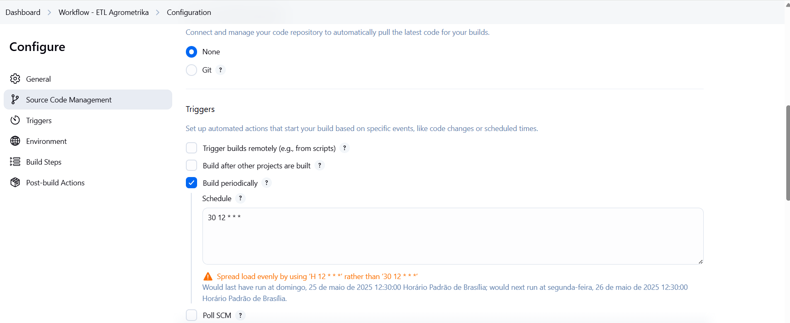

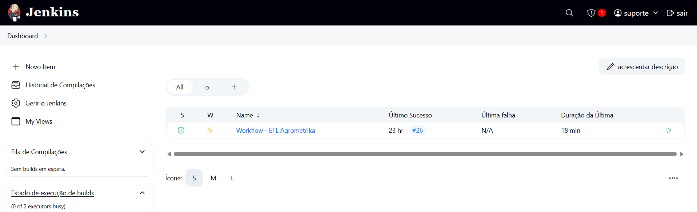

## ✒️ Autor

* **Desenvolvedor** - [Breno do Carmo](https://www.linkedin.com/in/breno-do-carmo/)

